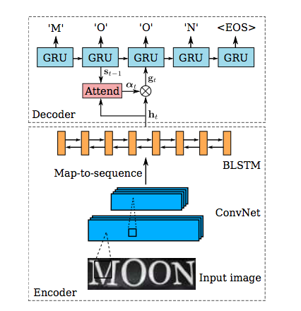

# Sequence Recognition Network

****

**PyTorch Implementation of SRN (Sequence Recognition Network)**

### Introduction

SRN combines the CNN and Seq2Seq together to optimize the performance of text recognition in natural scene. 

for more about the Sequence Recoginition Network, paper is here => [Robust Scene Text Recognition with Automatic Rectification](http://www.cv-foundation.org/openaccess/content_cvpr_2016/papers/Shi_Robust_Scene_Text_CVPR_2016_paper.pdf)

### Developing

**I am still proceeding in the project.** Any bug, please issue

### ChangeLog

**2017-09-11**: Support Mini-Batch

### TODO

1. support beam search